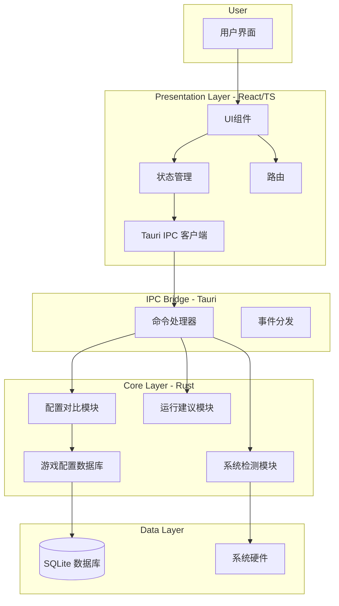
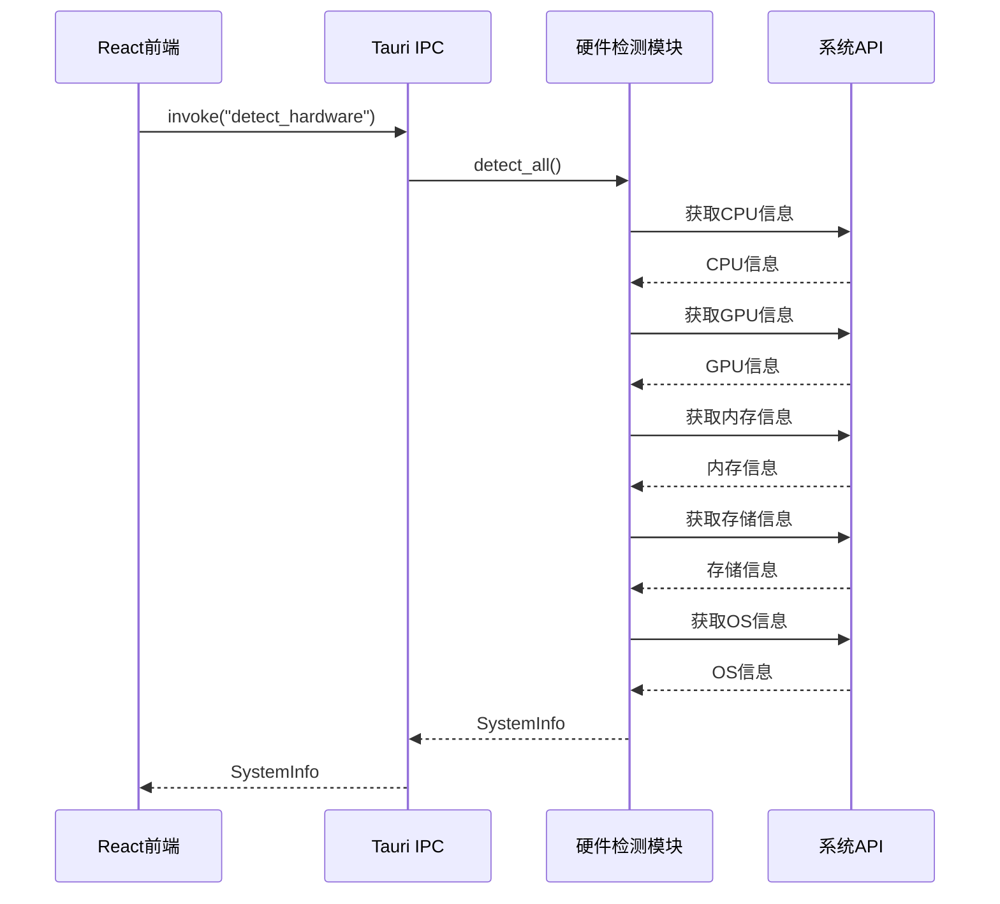
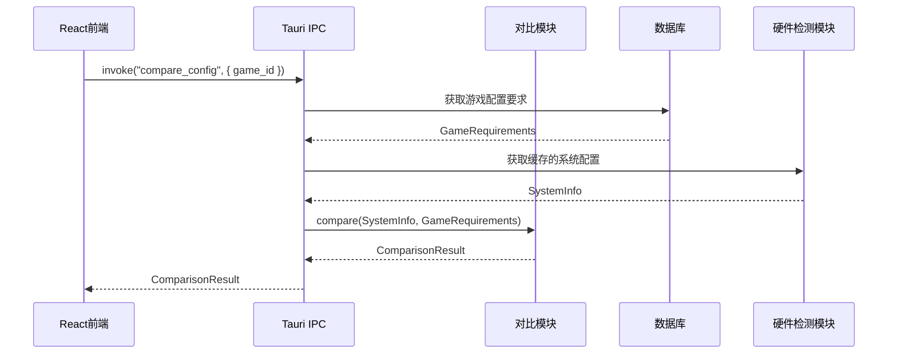
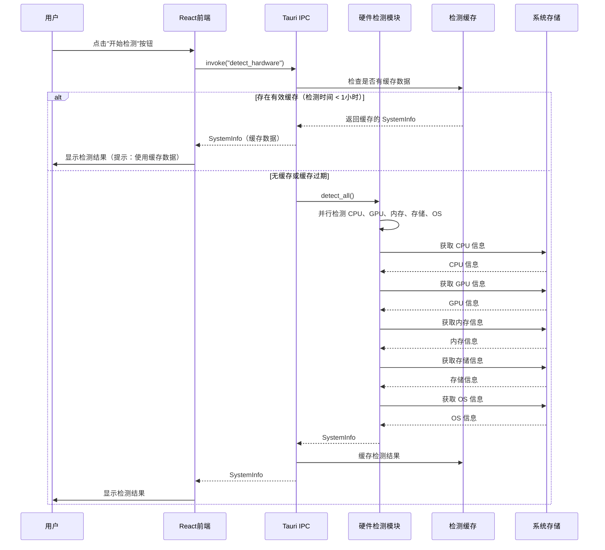
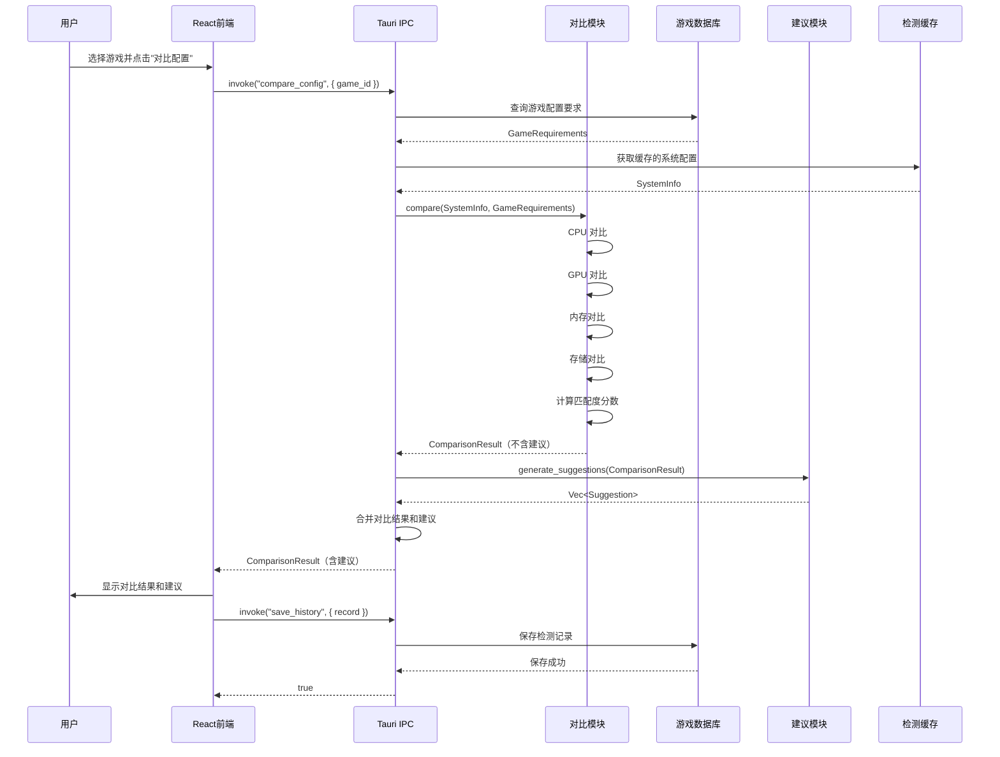
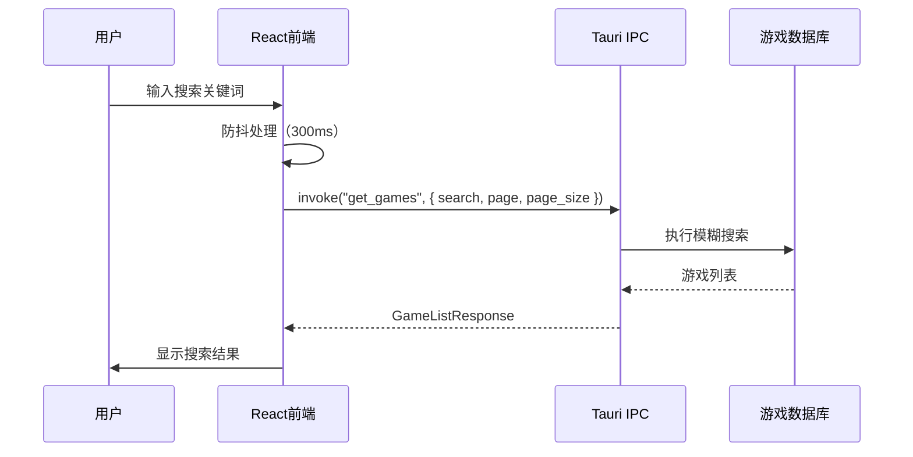
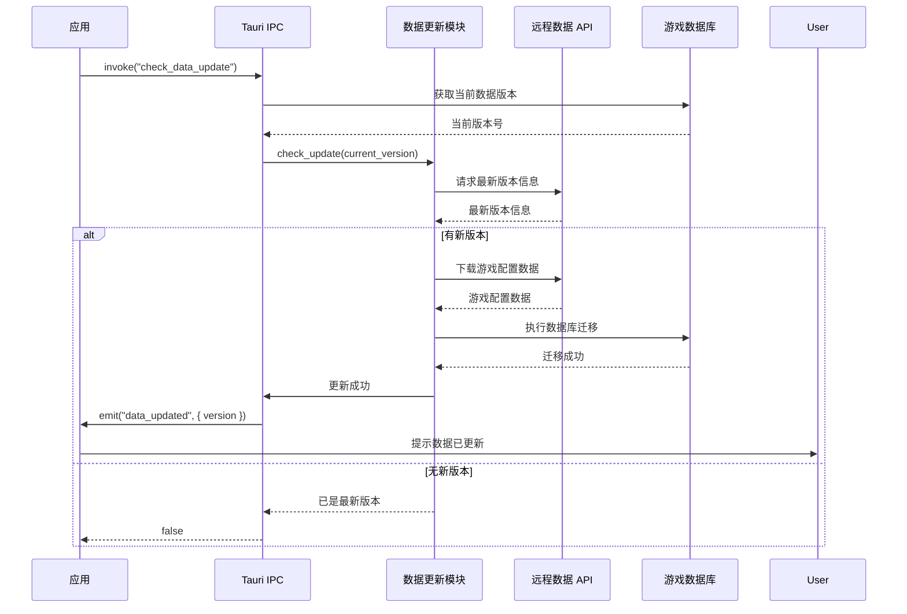

# SRun 系统架构文档

## 1. 架构概述

SRun 采用 **Tauri 2.x 分层架构**，将应用分为前端（Presentation Layer）和后端（Core Layer），通过 Tauri IPC（进程间通信）进行跨语言通信。后端基于 Rust 构建，负责系统级硬件检测和业务逻辑；前端基于 React + TypeScript 构建，负责用户界面展示。

**核心设计原则：**
- **关注点分离**：UI 逻辑与业务逻辑完全分离
- **跨平台抽象**：硬件检测通过平台抽象层统一接口
- **异步优先**：所有耗时操作采用异步处理，避免阻塞 UI
- **轻量级**：遵循 PROJECT.md 中的性能约束（内存 <= 100MB，启动 <= 3s）

## 2. 分层架构

### 2.1 架构图



### 2.2 分层说明

| 层级 | 技术栈 | 职责 |
|------|--------|------|
| **用户层** | - | 用户交互入口 |
| **表示层** | React 18 + TypeScript 5 | UI 渲染、状态管理、路由导航、IPC 调用 |
| **桥接层** | Tauri 2.x | Rust 命令注册、事件监听、参数序列化/反序列化 |
| **核心层** | Rust 2024 | 硬件检测、配置对比、建议生成、数据库操作 |
| **数据层** | SQLite 3 + 系统 API | 持久化存储、系统硬件信息获取 |

## 3. 核心模块设计

### 3.1 系统检测模块

**职责**：获取用户电脑的硬件配置信息，包括 CPU、GPU、内存、存储、操作系统等。

**设计模式**：策略模式 + 适配器模式

**模块结构**：
```
src/
└── detection/
    ├── mod.rs              # 模块入口，导出统一接口
    ├── traits.rs           # HardwareDetector trait 定义
    ├── cpu.rs              # CPU 检测实现
    ├── gpu.rs              # GPU 检测实现
    ├── memory.rs           # 内存检测实现
    ├── storage.rs          # 存储检测实现
    ├── os.rs               # 操作系统检测实现
    └── platform/           # 平台特定实现
        ├── windows.rs      # Windows 平台实现
        ├── macos.rs        # macOS 平台实现
        └── linux.rs        # Linux 平台实现
```

**关键特性**：
- 异步检测：使用 `tokio` 进行异步并行检测
- 平台抽象：通过 `HardwareDetector` trait 统一接口
- 缓存机制：检测结果缓存，避免重复检测

### 3.2 游戏配置数据库

**职责**：管理游戏配置数据的存储、查询和更新。

**设计模式**：仓储模式（Repository Pattern）

**模块结构**：
```
src/
└── database/
    ├── mod.rs              # 模块入口
    ├── connection.rs       # 数据库连接管理（连接池）
    ├── repository.rs       # 仓储接口定义
    ├── game_config.rs      # 游戏配置仓储实现
    ├── history.rs          # 检测历史仓储实现
    └── migrations.rs       # 数据库迁移脚本
```

**数据库表设计**：

| 表名 | 用途 |
|------|------|
| `games` | 游戏基本信息（ID、名称、封面、开发商） |
| `game_requirements` | 游戏配置要求（最低配置、推荐配置） |
| `detection_history` | 用户检测历史记录 |

**关键特性**：
- SQLite 连接池：使用 `r2d2` 实现连接复用
- 数据库迁移：使用 `rusqlite_migration` 管理 schema 变更
- 预加载数据：首次启动时初始化游戏配置数据

### 3.3 配置对比模块

**职责**：将用户硬件配置与游戏要求进行对比，生成匹配度报告。

**设计模式**：策略模式（不同维度的对比策略）

**模块结构**：
```
src/
└── comparison/
    ├── mod.rs              # 模块入口
    ├── engine.rs           # 对比引擎
    ├── strategies/         # 对比策略
    │   ├── cpu.rs          # CPU 对比策略
    │   ├── gpu.rs          # GPU 对比策略
    │   ├── memory.rs       # 内存对比策略
    │   └── storage.rs      # 存储对比策略
    └── report.rs           # 报告生成
```

**对比逻辑**：
1. 获取用户硬件配置
2. 获取游戏配置要求（最低/推荐）
3. 通过跑分模块获取用户硬件和配置要求的基准跑分
4. 按维度逐一对比（CPU → GPU → 内存 → 存储），计算每项高于配置要求的百分比
5. 计算匹配度分数（0-100）
6. 生成结构化报告（含百分比信息）

**匹配度等级**：
- **完美运行**（80-100分）：所有配置项超过推荐要求
- **流畅运行**（60-79分）：满足推荐配置，部分项可优化
- **基本运行**（40-59分）：满足最低配置，可能需要降低画质
- **无法运行**（0-39分）：不满足最低配置要求

**百分比计算方式**：
- 对于 CPU/GPU：基于基准跑分计算超出百分比 `(用户跑分 - 要求跑分) / 要求跑分 * 100%`
- 对于内存/存储：基于容量计算超出百分比 `(用户容量 - 要求容量) / 要求容量 * 100%`
- 负数表示低于配置要求，正数表示高于配置要求

### 3.4 硬件跑分模块

**职责**：提供 CPU 和 GPU 的基准跑分数据，用于精确对比硬件性能，计算高于配置要求的百分比。

**设计模式**：数据驱动模式（内嵌跑分数据库）+ 策略模式（名称匹配策略）

**模块结构**：
```
src/
└── benchmark/
    ├── mod.rs              # 模块入口，导出统一接口
    ├── database.rs         # 跑分数据库（内嵌 JSON/SQLite）
    ├── normalizer.rs       # 硬件名称归一化器
    └── calculator.rs       # 百分比计算引擎
```

**关键特性**：
- **离线跑分数据库**：预置主流 CPU/GPU 的基准跑分数据，支持离线查询
- **名称归一化**：将系统检测的完整硬件名称（如 "Intel(R) Core(TM) i7-12700K"）提取型号关键字进行匹配
- **百分比计算**：根据用户硬件跑分与游戏配置要求的跑分对比，计算超出百分比

**跑分数据来源**：
- CPU：参考 PassMark、Geekbench 5/6 基准测试分数
- GPU：参考 3DMark Time Spy、Fire Strike 基准测试分数

**名称归一化策略**：
1. 使用正则表达式提取型号关键字（如从 "Intel(R) Core(TM) i7-12700K" 提取 "i7-12700K"）
2. 支持别名匹配（如 "RTX 4070" 匹配 "GeForce RTX 4070"）
3. 品牌识别（Intel/AMD/NVIDIA）

### 3.5 运行建议模块

**职责**：根据对比结果生成优化建议和升级建议。

**模块结构**：
```
src/
└── suggestion/
    ├── mod.rs              # 模块入口
    ├── generator.rs        # 建议生成器
    ├── optimizer.rs        # 游戏设置优化建议
    └── upgrader.rs         # 硬件升级建议
```

**建议类型**：
- **游戏设置优化**：根据硬件配置推荐合适的画质、分辨率、帧率等设置
- **硬件升级建议**：针对不满足要求的配置项，推荐具体的硬件升级方案
- **系统优化建议**：操作系统层面的优化建议（驱动更新、系统清理等）

## 4. 跨平台硬件检测策略

### 4.1 Windows 平台

**CPU 检测**：
- 使用 `WMI`（Windows Management Instrumentation）查询 `Win32_Processor` 类
- 获取信息：处理器名称、核心数、线程数、基础频率、最大频率

**GPU 检测**：
- 使用 `DXGI`（DirectX Graphics Infrastructure）获取显卡信息
- 使用 `WMI` 查询 `Win32_VideoController` 类作为 fallback
- 获取信息：显卡名称、显存大小、驱动版本

**内存检测**：
- 使用 `GlobalMemoryStatusEx` API
- 获取信息：总内存、可用内存、物理内存

**存储检测**：
- 使用 `WMI` 查询 `Win32_LogicalDisk` 类
- 获取信息：磁盘类型（SSD/HDD）、总容量、可用空间

**操作系统检测**：
- 使用 `GetVersionExW` API 或 `WMI` 查询 `Win32_OperatingSystem`
- 获取信息：版本号、构建号、系统类型（32/64位）

### 4.2 macOS 平台

**CPU 检测**：
- 使用 `sysctl` 命令或 `mach` API
- 获取信息：处理器名称、核心数、频率

**GPU 检测**：
- 使用 `system_profiler` 命令（`SPDisplaysDataType`）
- 使用 `Metal` API 获取 GPU 能力
- 获取信息：显卡名称、显存大小

**内存检测**：
- 使用 `sysctl` 命令（`hw.memsize`）
- 获取信息：总内存、可用内存

**存储检测**：
- 使用 `diskutil` 命令或 `IOKit` API
- 获取信息：磁盘类型、总容量、可用空间

**操作系统检测**：
- 使用 `sw_vers` 命令或 `NSProcessInfo`
- 获取信息：macOS 版本号、构建号

### 4.3 Linux 平台

**CPU 检测**：
- 读取 `/proc/cpuinfo` 文件
- 获取信息：处理器名称、核心数、线程数、频率

**GPU 检测**：
- 使用 `lshw` 命令或读取 `/sys/class/drm/` 目录
- 使用 `Vulkan` API 获取 GPU 信息
- 获取信息：显卡名称、显存大小

**内存检测**：
- 读取 `/proc/meminfo` 文件
- 获取信息：总内存、可用内存、交换空间

**存储检测**：
- 使用 `lsblk` 命令或读取 `/sys/block/` 目录
- 获取信息：磁盘类型、总容量、可用空间

**操作系统检测**：
- 读取 `/etc/os-release` 文件
- 获取信息：发行版名称、版本号

### 4.4 统一抽象接口

通过 Rust trait 实现平台无关的硬件检测接口：

```rust
pub trait HardwareDetector {
    fn detect_cpu(&self) -> Result<CpuInfo, DetectionError>;
    fn detect_gpu(&self) -> Result<Vec<GpuInfo>, DetectionError>;
    fn detect_memory(&self) -> Result<MemoryInfo, DetectionError>;
    fn detect_storage(&self) -> Result<Vec<StorageInfo>, DetectionError>;
    fn detect_os(&self) -> Result<OsInfo, DetectionError>;
    
    // 批量检测所有硬件信息
    async fn detect_all(&self) -> Result<SystemInfo, DetectionError> {
        let cpu = self.detect_cpu()?;
        let gpu = self.detect_gpu()?;
        let memory = self.detect_memory()?;
        let storage = self.detect_storage()?;
        let os = self.detect_os()?;
        
        Ok(SystemInfo { cpu, gpu, memory, storage, os })
    }
}
```

**平台实现选择**：
```rust
#[cfg(target_os = "windows")]
mod windows;
#[cfg(target_os = "windows")]
pub use windows::WindowsDetector as PlatformDetector;

#[cfg(target_os = "macos")]
mod macos;
#[cfg(target_os = "macos")]
pub use macos::MacosDetector as PlatformDetector;

#[cfg(target_os = "linux")]
mod linux;
#[cfg(target_os = "linux")]
pub use linux::LinuxDetector as PlatformDetector;
```

## 5. 前端架构

### 5.1 组件结构

**目录结构**：
```
src/
├── components/           # 通用组件
│   ├── Layout/          # 布局组件
│   │   ├── Header.tsx   # 头部导航
│   │   └── Sidebar.tsx  # 侧边栏
│   ├── Card/            # 卡片组件
│   │   ├── HardwareCard.tsx    # 硬件信息卡片
│   │   ├── GameCard.tsx        # 游戏卡片
│   │   └── ResultCard.tsx      # 对比结果卡片
│   ├── Form/            # 表单组件
│   └── Common/          # 通用UI组件
├── pages/               # 页面组件
│   ├── Home.tsx         # 首页
│   ├── Detection.tsx    # 硬件检测页面
│   ├── GameSearch.tsx   # 游戏搜索页面
│   ├── Comparison.tsx   # 配置对比页面
│   ├── History.tsx      # 检测历史页面
│   └── Settings.tsx     # 设置页面
├── hooks/               # 自定义 Hooks
│   ├── useHardware.ts   # 硬件检测 Hook
│   ├── useGame.ts       # 游戏数据 Hook
│   └── useComparison.ts # 配置对比 Hook
├── services/            # API 服务
│   └── tauri.ts         # Tauri IPC 封装
├── store/               # 状态管理
│   └── index.ts         # 全局状态
└── types/               # TypeScript 类型定义
    └── index.ts         # 类型声明
```

**组件分层**：
- **原子层**：基础 UI 元素（Button、Input、Icon 等）
- **分子层**：组合组件（Card、Form、List 等）
- **组织层**：页面布局组件（Layout、Header、Sidebar）
- **页面层**：完整页面（Home、Detection、Comparison）

### 5.2 状态管理

**状态管理方案**：React Context + React Query

**全局状态（Context）**：
- 用户偏好设置
- 当前系统配置信息（缓存）
- UI 主题（浅色/深色模式）

**服务端状态（React Query）**：
- 游戏列表数据
- 游戏配置要求
- 检测历史记录
- 对比结果

**状态流转**：
1. 用户进入应用 → 获取缓存的系统配置
2. 用户发起检测 → 调用 Tauri IPC → 更新 Context
3. 用户选择游戏 → 调用 Tauri IPC 获取配置要求
4. 执行对比 → 生成对比结果 → 展示给用户

### 5.3 路由设计

```
/                 → Home 首页（欢迎页 + 快速检测入口）
/detection        → 硬件检测页面（显示当前配置）
/games            → 游戏搜索页面（搜索/选择游戏）
/games/:id        → 游戏详情页面（显示游戏配置要求）
/comparison/:id   → 配置对比页面（对比结果 + 建议）
/history          → 检测历史页面（历史记录列表）
/settings         → 设置页面（应用设置）
```

**路由守卫**：
- 公共路由：`/`、`/detection`、`/games`
- 需要登录的路由：`/history`（可选，视需求而定）

**懒加载**：
- 使用 React `lazy` 和 `Suspense` 实现路由级别的代码分割
- 减少首屏加载时间，提升启动性能

## 6. IPC 通信协议

### 6.1 命令定义

**硬件检测命令**：

| 命令名 | 功能 | 参数 | 返回值 |
|--------|------|------|--------|
| `detect_hardware` | 检测所有硬件信息 | 无 | `SystemInfo` |
| `detect_cpu` | 检测 CPU 信息 | 无 | `CpuInfo` |
| `detect_gpu` | 检测 GPU 信息 | 无 | `Vec<GpuInfo>` |
| `detect_memory` | 检测内存信息 | 无 | `MemoryInfo` |
| `detect_storage` | 检测存储信息 | 无 | `Vec<StorageInfo>` |
| `detect_os` | 检测操作系统信息 | 无 | `OsInfo` |

**游戏数据命令**：

| 命令名 | 功能 | 参数 | 返回值 |
|--------|------|------|--------|
| `get_games` | 获取游戏列表 | `page: number, page_size: number, search: string` | `GameListResponse` |
| `get_game` | 获取游戏详情 | `id: string` | `GameInfo` |
| `get_game_requirements` | 获取游戏配置要求 | `game_id: string` | `GameRequirements` |

**对比命令**：

| 命令名 | 功能 | 参数 | 返回值 |
|--------|------|------|--------|
| `compare_config` | 对比配置（含跑分百分比） | `game_id: string` | `ComparisonResult` |

**跑分命令**：

| 命令名 | 功能 | 参数 | 返回值 |
|--------|------|------|--------|
| `get_cpu_benchmark` | 获取 CPU 基准跑分 | `cpu_name: string` | `Option<BenchmarkData>` |
| `get_gpu_benchmark` | 获取 GPU 基准跑分 | `gpu_name: string` | `Option<BenchmarkData>` |
| `search_benchmark` | 搜索硬件跑分 | `query: string, type: "cpu"|"gpu"` | `Vec<BenchmarkData>` |

**历史记录命令**：

| 命令名 | 功能 | 参数 | 返回值 |
|--------|------|------|--------|
| `get_history` | 获取检测历史 | `limit: number` | `Vec<HistoryRecord>` |
| `save_history` | 保存检测记录 | `record: HistoryRecord` | `bool` |
| `delete_history` | 删除检测记录 | `id: string` | `bool` |

**设置命令**：

| 命令名 | 功能 | 参数 | 返回值 |
|--------|------|------|--------|
| `get_settings` | 获取应用设置 | 无 | `Settings` |
| `save_settings` | 保存应用设置 | `settings: Settings` | `bool` |

### 6.2 事件定义

**事件名**：

| 事件名 | 触发时机 | 携带数据 |
|--------|----------|----------|
| `detection_progress` | 硬件检测进度更新 | `{ step: string, progress: number }` |
| `data_updated` | 游戏配置数据更新完成 | `{ version: string }` |
| `app_update_available` | 检测到应用更新 | `{ version: string, url: string }` |

### 6.3 数据流

**检测流程数据流**：


**对比流程数据流**：


**数据序列化**：
- 使用 Tauri 内置的 `serde` 进行 JSON 序列化/反序列化
- 所有数据模型需实现 `Serialize` 和 `Deserialize` trait

## 7. 数据模型

### 7.1 系统配置模型

**CpuInfo**：
```rust
pub struct CpuInfo {
    pub name: String,           // 处理器名称
    pub cores: u32,             // 核心数
    pub threads: u32,           // 线程数
    pub base_frequency: f32,    // 基础频率（GHz）
    pub max_frequency: f32,     // 最大频率（GHz）
    pub cache_size: u64,        // 缓存大小（KB）
}
```

**GpuInfo**：
```rust
pub struct GpuInfo {
    pub name: String,           // 显卡名称
    pub vendor: String,         // 制造商
    pub memory: u64,            // 显存大小（MB）
    pub driver_version: Option<String>, // 驱动版本
}
```

**MemoryInfo**：
```rust
pub struct MemoryInfo {
    pub total: u64,             // 总内存（MB）
    pub available: u64,         // 可用内存（MB）
    pub used: u64,              // 已使用内存（MB）
}
```

**StorageInfo**：
```rust
pub struct StorageInfo {
    pub name: String,           // 磁盘名称
    pub device: String,         // 设备路径
    pub total: u64,             // 总容量（GB）
    pub available: u64,         // 可用空间（GB）
    pub disk_type: DiskType,    // 磁盘类型（SSD/HDD）
}

pub enum DiskType {
    SSD,
    HDD,
    Unknown,
}
```

**OsInfo**：
```rust
pub struct OsInfo {
    pub name: String,           // 操作系统名称
    pub version: String,        // 版本号
    pub build: String,          // 构建号
    pub architecture: String,   // 架构（x86_64/arm64）
}
```

**SystemInfo**：
```rust
pub struct SystemInfo {
    pub cpu: CpuInfo,
    pub gpu: Vec<GpuInfo>,
    pub memory: MemoryInfo,
    pub storage: Vec<StorageInfo>,
    pub os: OsInfo,
    pub detected_at: DateTime<Utc>, // 检测时间
}
```

### 7.2 游戏配置模型

**GameInfo**：
```rust
pub struct GameInfo {
    pub id: String,             // 游戏 ID
    pub name: String,           // 游戏名称
    pub cover_url: String,      // 封面图片 URL
    pub developer: String,      // 开发商
    pub publisher: String,      // 发行商
    pub release_date: Option<Date>, // 发行日期
    pub genres: Vec<String>,    // 游戏类型
}
```

**GameRequirements**：
```rust
pub struct GameRequirements {
    pub game_id: String,
    pub minimum: Requirement,   // 最低配置要求
    pub recommended: Requirement, // 推荐配置要求
}

pub struct Requirement {
    pub cpu: String,            // CPU 要求描述
    pub cpu_core_count: Option<u32>, // CPU 核心数要求
    pub cpu_frequency: Option<f32>,  // CPU 频率要求（GHz）
    pub gpu: String,            // GPU 要求描述
    pub gpu_memory: Option<u64>,     // 显存要求（MB）
    pub memory: u64,            // 内存要求（MB）
    pub storage: u64,           // 存储空间要求（GB）
    pub os: String,             // 操作系统要求
}
```

### 7.3 对比结果模型

**ComparisonResult**：
```rust
pub struct ComparisonResult {
    pub game_id: String,
    pub game_name: String,
    pub score: u8,              // 匹配度分数（0-100）
    pub level: MatchLevel,      // 匹配等级
    pub cpu_result: ComponentResult,
    pub gpu_result: ComponentResult,
    pub memory_result: ComponentResult,
    pub storage_result: ComponentResult,
    pub suggestions: Vec<Suggestion>,
    pub detected_at: DateTime<Utc>,
}

pub enum MatchLevel {
    Perfect,    // 完美运行（80-100）
    Smooth,     // 流畅运行（60-79）
    Basic,      // 基本运行（40-59）
    Impossible, // 无法运行（0-39）
}

pub struct ComponentResult {
    pub name: String,                    // 组件名称
    pub user_value: String,              // 用户配置值
    pub required_value: String,          // 要求配置值
    pub meets_minimum: bool,             // 是否满足最低配置
    pub meets_recommended: bool,         // 是否满足推荐配置
    pub benchmark_score: Option<u32>,    // 用户硬件基准跑分（CPU/GPU）
    pub required_score: Option<u32>,     // 配置要求基准跑分（CPU/GPU）
    pub percentage_above_minimum: f32,   // 高于最低配置的百分比（%）
    pub percentage_above_recommended: f32, // 高于推荐配置的百分比（%）
}

pub struct BenchmarkData {
    pub id: String,              // 硬件唯一标识
    pub name: String,            // 硬件型号名称（归一化后）
    pub brand: String,           // 品牌（Intel/AMD/NVIDIA）
    pub r#type: BenchmarkType,   // 类型（CPU/GPU）
    pub score: u32,              // 基准跑分
    pub aliases: Vec<String>,    // 别名列表（用于名称匹配）
}

pub enum BenchmarkType {
    CPU,
    GPU,
}

pub struct Suggestion {
    pub id: String,
    pub type: SuggestionType,
    pub title: String,
    pub content: String,
    pub priority: Priority,
}

pub enum SuggestionType {
    GameSetting,    // 游戏设置优化
    HardwareUpgrade, // 硬件升级建议
    SystemOptimization, // 系统优化建议
}

pub enum Priority {
    High,
    Medium,
    Low,
}
```

## 8. 性能优化策略

### 8.1 启动优化

**后端优化**：
- **延迟初始化**：非关键模块（如数据库、游戏配置）延迟加载
- **异步启动**：硬件检测放在后台异步执行，不阻塞主进程
- **减少依赖**：仅引入必要的 Rust crate，避免依赖膨胀

**前端优化**：
- **代码分割**：使用 React `lazy` 实现路由级别代码分割
- **预加载**：首屏必要资源预加载
- **Service Worker**：缓存静态资源，加速二次启动

**目标**：冷启动 <= 3s，热启动 <= 1s

### 8.2 内存优化

**后端优化**：
- **连接池复用**：SQLite 连接使用 `r2d2` 连接池，避免频繁创建/销毁
- **检测结果缓存**：硬件检测结果缓存在内存中，定期刷新（如每小时）
- **按需加载**：游戏配置数据按需加载，不一次性加载全部

**前端优化**：
- **虚拟列表**：游戏列表使用虚拟滚动，避免大量 DOM 节点
- **图片优化**：游戏封面使用 WebP 格式，支持懒加载
- **状态清理**：组件卸载时清理不必要的状态和订阅

**目标**：内存占用 <= 100MB

### 8.3 UI 响应优化

**后端优化**：
- **异步检测**：所有硬件检测操作使用 `tokio` 异步执行
- **进度反馈**：通过 `detection_progress` 事件实时反馈检测进度
- **超时控制**：每个检测操作设置合理超时时间

**前端优化**：
- **防抖节流**：搜索输入等频繁操作使用防抖处理
- **骨架屏**：数据加载时显示骨架屏，提升感知速度
- **避免阻塞**：复杂计算放在 Web Worker 中执行

**目标**：UI 响应时间 <= 200ms

## 9. 核心业务流程

### 9.1 检测流程序列图

**完整检测流程**：


### 9.2 对比流程

**配置对比流程**：


### 9.3 游戏搜索流程



### 9.4 数据更新流程



